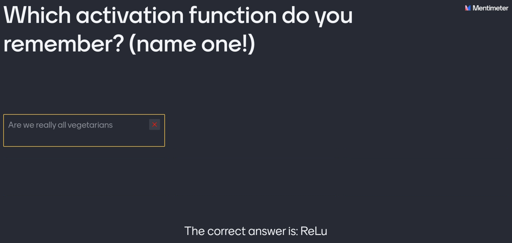
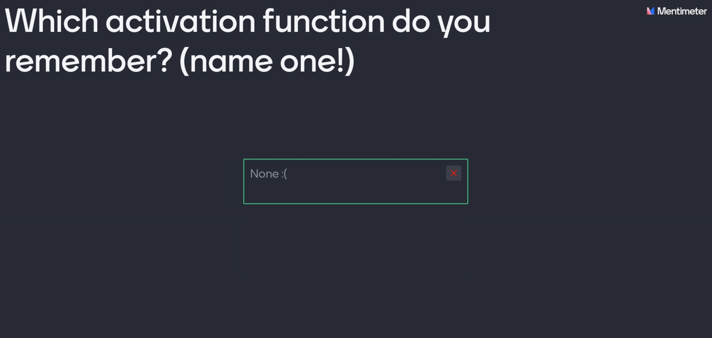
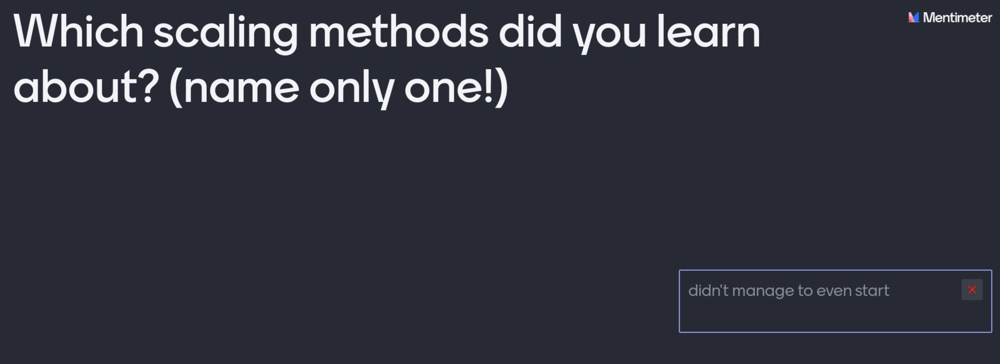
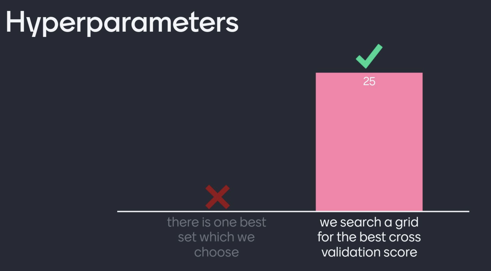
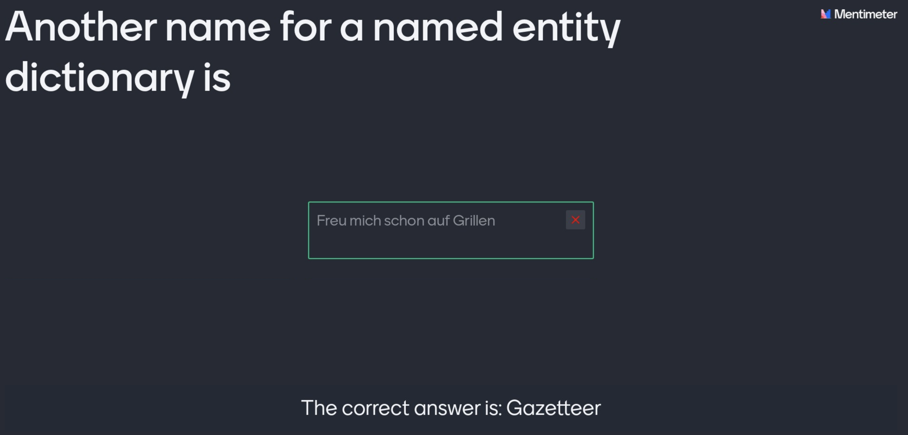
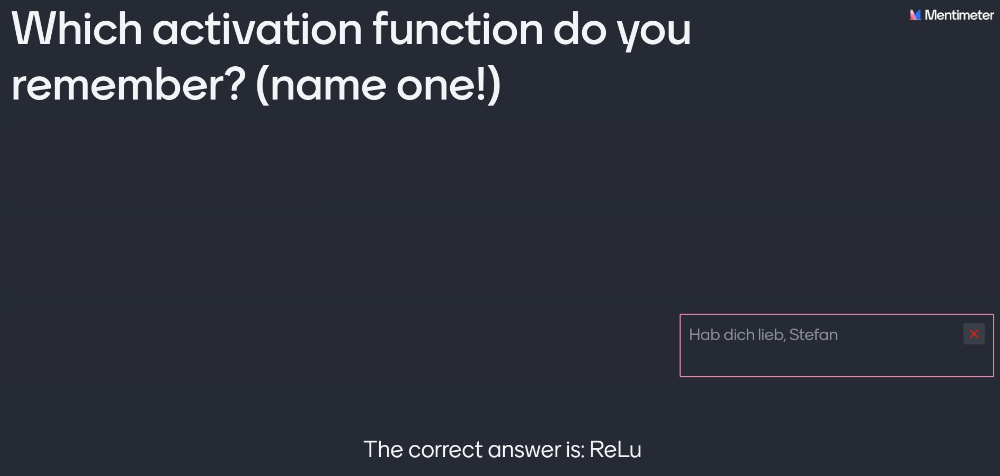
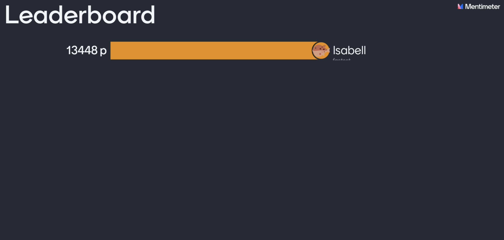
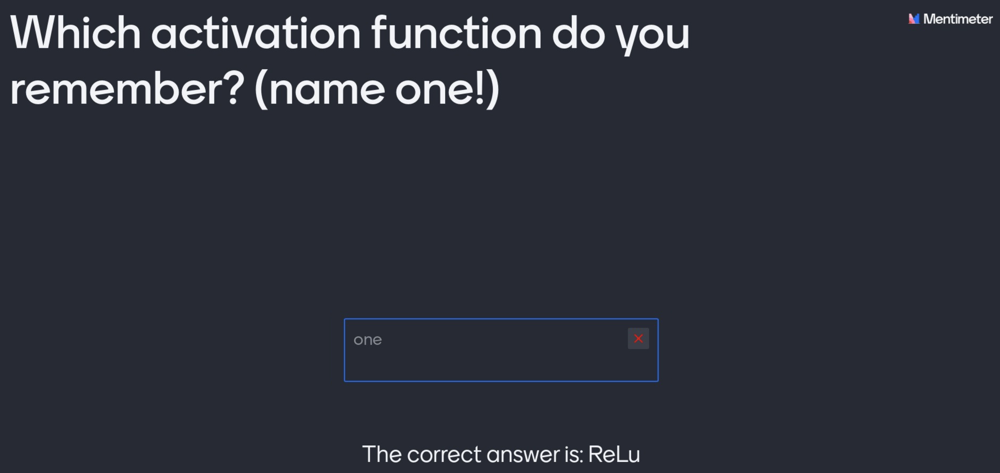

```{r setup, include=FALSE}
rm(list=ls())

library(readxl)
library(ggplot2)
library(hrbrthemes)
library(dplyr)
library(tidyr)
library(viridis)
library(png)
knitr::opts_chunk$set(echo = TRUE)

l1 <- read_excel("l1.xlsx",skip = 2)
l2 <- read_excel("l2.xlsx",skip = 2)
l3 <- read_excel("l3.xlsx",skip = 2)
l4 <- read_excel("l4.xlsx",skip = 2)
l5 <- read_excel("l5.xlsx",skip = 2)

l1$lecture<-1
l2$lecture<-2
l3$lecture<-3
#l4$lecture<-4
#l5$lecture<-5

df<-rbind(l1[,(dim(l1)[2]-3):dim(l1)[2]],
          l2[,(dim(l2)[2]-3):dim(l2)[2]],
          l3[,(dim(l3)[2]-3):dim(l3)[2]],
          l4[,(dim(l4)[2]-3):dim(l4)[2]],
          l5[,(dim(l5)[2]-3):dim(l5)[2]]
)

colnames(df)<-c("Did you learn about interesting concepts?",
                "Neither overwhelmed nor bored?",
                "Did you have fun?",
                "lecture")
```

## There was a lot of input ...

## ... some concepts were not only hard to understand ...
```{r hard, echo=FALSE, fig.align="center", cache=TRUE, out.width="800px"}

```

## ... but overwhelming ...
```{r overwhelmed, echo=FALSE, fig.align="center", cache=TRUE, out.width="800px"}

```

## ... really overwhelming ...
```{r overwhelmed2, echo=FALSE, fig.align="center", cache=TRUE, out.width="800px"}

```

## ... but then we made progress!
```{r success, echo=FALSE, fig.align="center", cache=TRUE, out.width="800px"}

```

## ... and we got more and more confident ...
```{r success2, echo=FALSE, fig.align="center", cache=TRUE, out.width="800px"}
df %>% drop_na() %>%
  ggplot(aes(x=`Neither overwhelmed nor bored?`, group=factor(lecture), fill=factor(lecture))) +
    geom_density(adjust=1.5, alpha=.4) +
    theme_ipsum() +
  ggtitle("Neither overwhelmed nor bored?")
```

## ... not just less bored ...
```{r success3, echo=FALSE, fig.align="center", cache=TRUE, out.width="800px"}
df %>% drop_na() %>%
  ggplot(aes(x=`Did you learn about interesting concepts?`, group=factor(lecture), fill=factor(lecture))) +
    geom_density(adjust=1.5, alpha=.4) +
    theme_ipsum() +
  ggtitle("Did you learn about interesting concepts?")
```

## ... well, I might still have my doubts ...
```{r doubts, echo=FALSE, fig.align="center", cache=TRUE, out.width="800px"}

```

## What counts most is that we had fun ...

## ... and we got better at that, too!
```{r fun, echo=FALSE, fig.align="center", cache=TRUE, out.width="800px"}
df %>% drop_na() %>%
  ggplot(aes(x=`Did you have fun?`, group=factor(lecture), fill=factor(lecture))) +
    geom_density(adjust=1.5, alpha=.4) +
    theme_ipsum() +
  ggtitle("Did you have fun?")
```

## Thanks for being such a nice ...
```{r nice, echo=FALSE, fig.align="center", cache=TRUE, out.width="800px"}

```

## ... heartwarming ...
```{r heart, echo=FALSE, fig.align="center", cache=TRUE, out.width="800px"}

```

## ... and funny crowd!

```{r funny, echo=FALSE, fig.align="center", cache=TRUE, out.width="800px"}

```

## Thank you!
```{r thanks, echo=FALSE, fig.align="center", cache=TRUE, out.width="800px"}

```

## Let‘s keep in touch!
Dr. Carina I. Hausladen <br>
Postdoctoral Researcher <br>
carina.hausladen@gess.ethz.ch <br>
<br>

ETH Zurich <br>
Computational Social Science COSS <br>
Stampfenbachstrasse 48 <br>
8092 Zurich