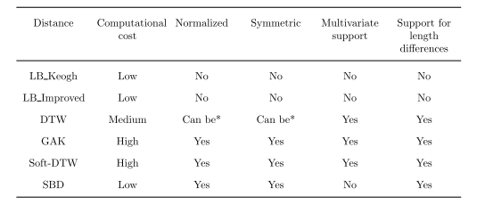
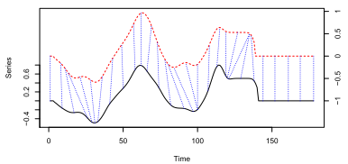
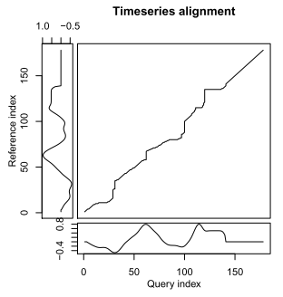
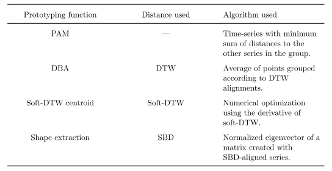
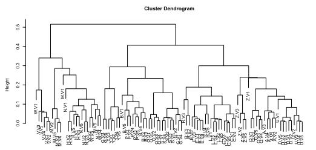
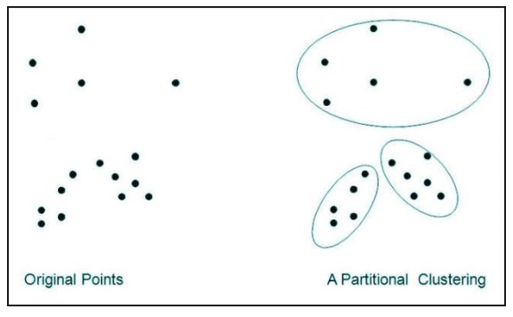
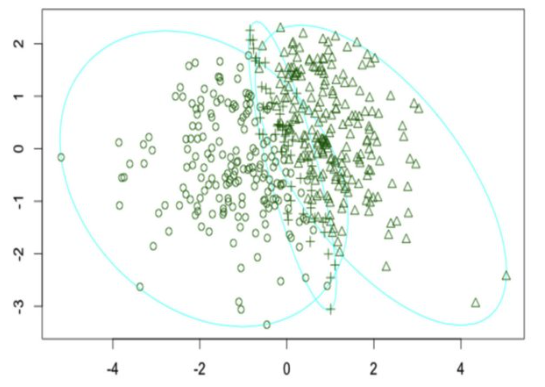
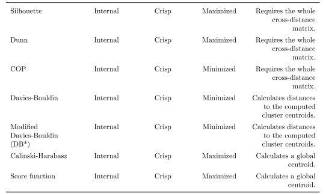

```{r setup, include=FALSE, cache=TRUE}
rm(list = ls())
knitr::opts_chunk$set(echo = TRUE)
```

# Introduction

## This tutorial

- In this tutorial we will investigate the characteristics of clustering.
- We will look at the following concepts
  - distance measures
  - prototypes
  - clustering algorithms
  - cluster evaluation
- We will do so by making use of the R package `dtwclust`.
- We will investigate the methodology on a concrete example: We cluster (simulated) behavioral data from a public good game.

- We will see that the algorithm does a reasonably good job at clustering the data. 
- It clusters patterns of observed contributions, combined with patterns of observed experiences. 
- However, there is no one-to-one mapping of 5 patterns to 5 types.

```{r import, include=FALSE, cache=TRUE}
library(dtwclust)
library(tidyr)
library(ggplot2)
library(stargazer)
library(janitor)
library(ggpubr)
library(RColorBrewer)
library(knitr) 
library(png) 
library(grid)

graphics.off()

source("scr_r/data_simulation.r")
source("scr_r/helpers.r")
```

## Simulate Type Space
- We simulate decision data from a public goods game with 10 rounds, group size 4, and endowment 20.
- We simulate 5 behavioral types: short-sighted freerider, far-sighted freerider, conditional cooperator, hump shaped contributor, altruist.
- Each type has a certain reaction function, but it does not act upon it at all times. Therefore, we add noise ($\sigma$ and $\eta$).

`r emo::ji("nerd")`: Vary some parameter, e.g. numrounds, sigma, eta, grpsize, endowment.
```{r simulate, include=TRUE, cache=TRUE}
simdat_grp <- generate_data(numrounds = 10, 
                            sigma = .3, eta = 0.3, 
                            n = 4,
                            types = c(1,2,3,4,5), grpsize = 4, endowment = 20, 
                            rand_first = FALSE, random_subset = FALSE, 
                            add_errors = TRUE)
```

```{r simulate2, echo=FALSE, cache=TRUE}
colnames(simdat_grp)[5]<-"experience"
simdat_grp <- simdat_grp[simdat_grp$period > 1,]
head(simdat_grp)
```

---

`dtwclust` needs the data to be in a specific form (list `ls`) to use it as cluster input.
```{r input list, include=TRUE, cache=TRUE}
id<-unique(simdat_grp$uid)
ls <- list()
for (j in 1:length(id)) {  
  df_sb<-simdat_grp[simdat_grp$uid==id[j], c("contribution", "experience")]
  ls[[j]]<-df_sb
}
ls <- reinterpolate(x = ls, n = max(simdat_grp$period)-1, multivariate = TRUE) 
```

# Distance Measures
## What are Distance Measures?
- Distance measures provide quantification for the dissimilarity between two time-series. 
- It is a task that is repeated very often and loops across all data objects applying a suitable distance function. 

### Characteristics of distance measures implemented in dtwclust. 
Table by @Sarda-Espinosa2017.
```{r distance, echo=FALSE, fig.align="center", cache=TRUE, out.width="600px"}

```

--- 

### Dynamic Time Warping
- DTW is a dynamic programming algorithm that compares two series and tries to find the optimum warping path between them. 
- DTW is computationally expensive. If $x$ has length $n$ and $y$ has length $m$, the DTW distance between them can be computed in $O(nm)$ time, which is quadratic if $m$ and $n$ are similar. 
- The DTW distance can deal with series of different length. 

```{r sample, echo=FALSE, fig.align="center", cache=TRUE, out.width="600px"}

```
Figure from @Sarda-Espinosa2017

- The figure shows sample alignment performed by DTW between two series. 
- The dashed blue lines exemplify how some points are mapped to each other (warped in time).

---    

### DTW—how does it work?
- Create a local cost matrix $lcm$, which has $n\cdot m$ dimensions.
- Such a matrix must be created for every pair of series compared.
- DTW finds the path that minimizes the alignment between $x$ and $y$ by iteratively stepping through $lcm$, starting at $lcm(1, 1)$ and finishing at $lcm(n,m)$, and aggregating the cost. 
- At each step, the algorithm finds the direction in which the cost increases the least under the chosen constraints. 

---

```{r opt_path, echo=FALSE, fig.align="center", cache=TRUE, out.width="300px"}

```
- The figure shows the optimum path found (corresponding to previous figure).  
- The square in the center represents the $lcm$ created for these specific series.

---

### Soft-DTW
- DTW can be regularized via smoothing [@Cuturi2011].
- Soft-dtw possesses differentiability; Therefore, a gradient function can be obtained.
- The gradient function is used to calculate centroids with numerical optimization.

$$
dtw_\gamma(x, y) = min^\gamma{\langle A,\Delta(x, y)\rangle, A \epsilon A(n,m)}
$$

- Disadvantages
    - The distance between $x$ and itself is not necessarily zero.
    - It has quadratic complexity with respect to the series’ lengths. 
- Advantages
    - It supports multivariate series as well as different lengths.
    - It provides smoothed results by a user-defined parameter $\gamma$.

---

### Implementation

`r emo::ji("nerd")`: Experiment with different parameters (gamma, window size, norm).
```{r distances, eval=FALSE} 
distances = pdc_configs(type = "distance",
                        partitional = list(
                          sdtw = list(window.size = window_size, 
                          norm = c("L2"),
                          gamma = c(0.001))))
```

- $\gamma$
  - If you are interested in the impact of $\gamma$, read @Cuturi2011, Table 1.
- window 
  - global constraint 
  - It is common to use a window whose size is 10% of the series’ length. 
  - Sometimes smaller windows produce even better results [@Ratanamahatana2004].
- norm
  - For each element $(i, j)$ in $lcm$, the $l_p$ norm between $x_i$ and $y_j$ must be computed.
  - The l1 and l2 vector norms, also known as Manhattan and Euclidean distances.
  
# Time-series Prototypes
## What are Time-series Prototypes?

- All series within a cluster should be similar to each other.
- One time-series should effectively summarize the most important characteristics of all series in a given cluster.
- The distance measure should correspond to the one used by the prototyping function
- A prototype can be generated (e.g. mean) or a reference time-series is chosen.

```{r proto, echo=FALSE, fig.align="center", cache=TRUE, out.width="600px"}

```

---

### DTW Barycenter Averaging (DBA)

- DBA requires a series to be used as centroid.
- It is an iterative, global method: The order in which the series enter the prototyping function does not affect the outcome. 
- It can support series with different length directly.
- It usually begins by randomly selecting one of the series in the data. 
- On each iteration, the DTW alignment between each series in the cluster $C$ and the centroid is computed. 
- This is iteratively repeated until a certain number of iterations are reached, or until convergence is assumed. 

```{r prototypes, eval=FALSE} 
centroids = pdc_configs(type = "centroid",
                        partitional = list(
                          dba=list(norm = c('L2'), 
                                   znorm = c(FALSE)))) #mean=0, sd=1
```

# Clustering Algorithms
## Three Types of Algorithms
We'll discuss three different types of algorithms

- Hierarchical clustering (crisp)
- Partitional clustering (crisp)
- Fuzzy clustering

## Hierarchical Clustering

```{r hier, echo=FALSE, fig.align="center", cache=TRUE,out.width="400px"}

```

- The procedure is deterministic: It will always give the same result for a chosen set of (dis)similarity measures. 
- Algorithms can be agglomerative or divisive (less common).
- In agglomerative procedures, every member of the data starts in its own cluster, and members are grouped together sequentially based on the similarity measure until all members are contained in a single cluster. 
- Divisive procedures do the exact opposite. 
- Both strategies suffer from a lack of flexibility, because they cannot perform adjustments once a split has been done. 

## Partitional Clustering

- The data is explicitly assigned to (only) one cluster out of $k$ total clusters.
- $k$ must be specified beforehand.
- It is a combinatorial optimization problem: It minimizes the intra-cluster distance while maximizes the inter-cluster distance. 
- Some of the most popular partitional algorithms are k-means and k-medoids.
- Partitional clustering procedures are stochastic due to their random start. 
- Thus, it is common practice to test different random starts (via `nrep`) to evaluate several local optima and choose the best result out of all the repetitions.

```{r part, echo=FALSE, fig.align="center", cache=TRUE, out.width="400px"}

```
Example for Partitional Clustering, figure from @Alhenak2019.

---

### How does it work?

- First, $k$ centroids are randomly initialized and assigned to individual clusters. 
- The distance between all objects in the data and all centroids is calculated.
- A prototyping function is applied to each cluster to update the corresponding centroid. 
- Distances and centroids are updated iteratively until a certain number of iterations (via `iter.max`) have elapsed, or no object changes clusters any more. 

```{r partitional, eval=FALSE} 
controls = list(partitional = partitional_control(iter.max = 2L, 
                                                  nrep = 2L)),
```

## Fuzzy Clustering

- The previous procedures discussed result in what is known as a crisp or hard partition.
- In crisp partitions, each member of the data belongs to only one cluster, and clusters are mutually exclusive. 
- Fuzzy Clustering creates a fuzzy or soft partition in which each member belongs to each cluster to a certain degree. 
- The degree of belongingness is constrained so that its sum equals $1$ across all clusters.
- If there are $N$ objects in the data and $k$ clusters are desired, an $N×k$ membership matrix $u$ can be created, where all the rows must sum to $1$

```{r fuzzy, echo=FALSE, fig.align="center", cache=TRUE, out.width="350px"}

```
Figure from @Bolin2014

## Implementation
- Now, let's combine our knowledge about distance functions, prototypes, and clustering algorithms to define the scoring function `define_config_multi`.

`r emo::ji("nerd")`: Use hierarchical (instead of partitional) clustering.
```{r cluster_prep, include=TRUE, cache=TRUE}
define_config_multi <- function(num_clust, window_size, typs = c("p")){
  cfgs <- compare_clusterings_configs(
    types = typs,  
    k = num_clust,
    controls = list(partitional = partitional_control(iter.max = 2L, nrep = 2L)),
    preprocs = pdc_configs(type = "preproc",
                           none = list(),
                           share.config = c("p")),
    distances = pdc_configs(type = "distance",
                            partitional = list(
                              sdtw = list(window.size = window_size, norm = c("L2"),
                                          gamma = c(0.001)))),
    centroids = pdc_configs(type = "centroid",
                            partitional = list(
                              dba=list(norm = c('L2'), znorm = c(FALSE)))))
  return(cfgs)
}

cfgs<-define_config_multi(num_clust = c(10:20), window_size = 1)  
```

# Cluster Evaluation
## Cluster Validity Indices

- Clustering is an unsupervised procedure.
- Evaluating its performance can be subjective. 
- To standardize cluster evaluation, various cluster validity indices (CVIs) have been developed.
- A comprehensive overview can be found in @Arbelaitz2013.
- CVIs can be either tailored to crisp or fuzzy partitions.
  - Crisp: CVIs can be classified as internal or external 
    - Internal CVIs only consider the partitioned data and try to define a measure of cluster purity. 
    - External CVIs compare the obtained partition to the correct one. Thus, external CVIs can only be used if the ground truth is known.

```{r edit, include=FALSE, cache=TRUE}
#modifying dtw's function to apply rankvote instead of majority scoring
cvi_evaluators_custom<- source("scr_R/score_internal_own.r")  
cvi_evaluators_custom<-cvi_evaluators_custom$value

unlockBinding("cvi_evaluators", as.environment("package:dtwclust"))
assign("cvi_evaluators", cvi_evaluators_custom , as.environment("package:dtwclust"))
lockBinding("cvi_evaluators", as.environment("package:dtwclust"))
```

```{r cluster_prep_cvi, include=TRUE, cache=TRUE}
internal_evaluators<-cvi_evaluators("internal", fuzzy = FALSE)
score_internal <- internal_evaluators$score
```

## Cluster Validity Indices

- Most of the CVIs estimate the cluster cohesion (within or intra-variance) and the cluster separation (between or inter-variance) and combine them to compute a quality measure. 
- The combination is performed by a division (ratio-type indices) or a sum (summation-type indices) [@Kim2005].

---

```{r cvis_plot_theory, echo=FALSE, fig.align="center", cache=TRUE, out.width="600px"}

```

- Knowing which CVI will work best cannot be determined a priori, so they should be tested for each specific application.
- Many CVIs can be utilized and compared to each other, e.g. by using a majority vote to decide on a final result. 

```{r cluster_prep_maj, include=TRUE, cache=TRUE}
pick_majority <- internal_evaluators$pick
```

## Implementation

This is where the actual clustering takes place.
```{r clustering, include=TRUE, cache=TRUE, warning=FALSE}
require(doParallel)
registerDoParallel(cl <- makeCluster(detectCores()))

comparison <- compare_clusterings( ls, 
                                   types = c("p"), 
                                   configs = cfgs,
                                   score.clus = score_internal,
                                   pick.clus = pick_majority,
                                   trace = TRUE,
                                   return.objects = TRUE)
```

---

Next, we transform the `comparison` object which is the result of the clustering to `df_clust`.
```{r one_df, include=TRUE, cache=TRUE}
clust_data<-comparison[["pick"]][["object"]]@datalist
names(clust_data)<-id
clust_data <- lapply(seq_along(clust_data), ## make one DF out of list of matrices
                     function(i) {
                       data.frame(uid = i,
                                  study=names(clust_data)[i], 
                                  contribution=clust_data[[i]][,"contribution"],
                                  experience=clust_data[[i]][,"experience"],
                                  period=2:(dim(clust_data[[i]])[1]+1))
                     })
clust_data<-do.call(rbind, clust_data)

clust_clust<-as.data.frame(comparison[["pick"]][["object"]]@cluster)
clust_clust$uid<-1:dim(clust_clust)[1]

df_clust<-merge(clust_data, clust_clust, by = "uid")  # cluster from the simulated df
colnames(df_clust)[6]<-"cluster"
```

---

Next, we reshape `df_clust` from wide to long to be able to plot it via ggplot.
```{r df_long, include=TRUE, cache=TRUE}
df_clust_lng <- gather(df_clust, who, contribution, contribution:experience, factor_key=TRUE)
df_clust_lng$clust<-factor(df_clust_lng$clust)
df_clust_lng$study<-factor(df_clust_lng$study)
colnames(df_clust_lng)[6]<-"contribution"
head(df_clust_lng)
```

## Plot CVIs 
- Next, we want to plot the internal CVIs.
- Please note that the following chunks only makes sense if you passed $k>1$ to the clustering function. 
- First, we extract the CVIs and standardize them $\epsilon [0,1]$ to make them comparable.

`r emo::ji("nerd")`: You do not have to use all CVIs available. Experiment with a subset.
```{r cvis_extract, include=TRUE, cache=TRUE}
expintCVI<-comparison[["results"]][["partitional"]]
cvis<-c("Sil","D","COP","DB","DBstar","CH","SF")
expintCVI[cvis] <- lapply(expintCVI[,cvis],
                           function(x){(x-min(x))/(max(x)-min(x))}) 
```

---

- We go on and recode those CVIs that need to be minimized (instead of maximized).
```{r cvis_recode, include=TRUE, cache=TRUE}
expintCVI$COP <- 1 - expintCVI$COP
expintCVI$DBstar <- 1 - expintCVI$DBstar
expintCVI$DB <- 1 - expintCVI$DB

expintCVI<-expintCVI[expintCVI$gamma_distance==0.001,]
```

- We use partitional clustering with several restarts.
- Therefore, we either need to average the results or pick one round.
```{r cvis_gather, include=TRUE, cache=TRUE}
CVI_long <- gather(expintCVI[expintCVI$rep==1, c("k",cvis)], CVIs, CVI_val, Sil:SF, factor_key=TRUE)
```

## Calculate Rankvote

- The majority vote of all CVIs is often inconclusive. 
- We therefore proceed the following way: for each choice parameter in question, we rank the scores of each CVI. 
- For each outcome, we calculate the sum over all 7 ranks. 
- We choose the parameter that receives the highest sum of ranks.
```{r cvis_rankvote, include=FALSE, cache=TRUE}
expintCVI$rankSil <- rank(expintCVI$Sil)
expintCVI$rankD <- rank(expintCVI$D)
expintCVI$rankDB <- rank(expintCVI$DB)
expintCVI$rankDBstar <- rank(expintCVI$DBstar)
expintCVI$rankSF <- rank(expintCVI$SF)
expintCVI$rankCH <- rank(expintCVI$CH)
expintCVI$rankCOP <- rank(expintCVI$COP)

expintCVI$rankvote <- NA
for (i in 1:dim(expintCVI)[1]) {
  expintCVI$rankvote[i] <- expintCVI$rankSil[i] + expintCVI$rankD[i] +  expintCVI$rankDB[i] + expintCVI$rankDBstar[i] +  expintCVI$rankSF[i] + expintCVI$rankCH[i] +  expintCVI$rankCOP[i]
}

int<-expintCVI$k[expintCVI$rankvote == max(expintCVI$rankvote)]
```

```{r cvis_plot, echo=FALSE, cache=TRUE, fig.align="center", out.width="400px"}
CVI_long$k<-as.numeric(CVI_long$k)
p_cvi<-ggplot(CVI_long, aes(x=k, y=CVI_val, group=CVIs, color=CVIs)) + 
  geom_point(size=0.3)+
  geom_line(alpha=0.5)+
  scale_x_continuous(breaks = seq(0, 100, by = 5)) +
  scale_y_continuous(breaks = seq(0, 1, by = 0.5)) +
  ylab("CVIs")+
  geom_vline(xintercept = int, linetype="dashed", 
                  color = "black", size=0.5)+
  theme(legend.position="right", 
        panel.border = element_rect(colour = "black", fill = NA),
        panel.background=element_blank(), 
        panel.grid.minor=element_blank(), 
        panel.grid.major=element_blank())
p_cvi
```


## Plot cluster versus types 
Here we add the cluster information from the `comparison` object to the dataframe including the simulated data.
```{r cluster_vs_types, include=TRUE, cache=TRUE}
simdat_grp<-simdat_grp[,1:9]
simdat_grp$type[simdat_grp$type == '1'] <- 'short-sighted freerider'
simdat_grp$type[simdat_grp$type == '2'] <- 'hump shaped'
simdat_grp$type[simdat_grp$type == '3'] <- 'conditional cooperator'
simdat_grp$type[simdat_grp$type == '4'] <- 'altruist'
simdat_grp$type[simdat_grp$type == '5'] <- 'far-sighted freerider'

simclust <- as.data.frame(comparison[["pick"]][["object"]]@cluster)
simclust <- cbind(simclust, id)
names(simclust) <- c("clust", "uid")
simdat_grp <- merge(simdat_grp, simclust, by = "uid")  ##add cluster information
```

---

Again, we reshape the data frame from wide to long to plot it via ggplot.
```{r df_long_2, include=TRUE, cache=TRUE}
data_long <- gather(simdat_grp[, c("uid", "period", "contribution", "experience", "clust", "type")], 
                    who, contribution, contribution:experience, factor_key=TRUE)
head(data_long)
```

## Cluster Found
```{r plot_cluster, echo=FALSE, cache=TRUE, fig.align="center"}
myColors <- brewer.pal(5,"Set1")
names(myColors) <- levels(data_long$type)
colScale <- scale_colour_manual(name = "type",values = myColors, drop=FALSE)

p_clust<-ggplot(data=data_long, aes(x=period, y=contribution, color=type, group=factor(uid))) + 
  geom_line(size=0.2, alpha=0.3) +
  geom_point(size=0.1, alpha=0.3) +
  facet_grid(clust~who)+
  scale_x_continuous(breaks = seq(1, 10, by = 1)) +
  scale_y_continuous(breaks = seq(0, 1, by = 0.5)) +
  ylab("contribution")+
  theme(legend.position="right", 
        legend.key = element_blank(),
        panel.border = element_rect(colour = "black", fill = NA),
        panel.background=element_blank(), 
        panel.grid.minor=element_blank(), 
        panel.grid.major=element_blank()
        )+
  guides(colour = guide_legend(override.aes = list(alpha = 1, size=0.8)))+
  scale_colour_manual(name = "type", values = myColors, drop=FALSE,limits = c('altruist','conditional cooperator','far-sighted freerider','hump shaped','short-sighted freerider'))
p_clust
```

## Types Simulated
```{r plot_type, echo=FALSE, cache=TRUE, fig.align="center"}
p_type<-ggplot(data=data_long, aes(x=period, y=contribution, color = factor(clust), group=factor(uid))) + 
  geom_line(size=0.3) +
  theme(legend.position = "none") +
  facet_grid(type~who)+
  scale_x_continuous(breaks = seq(1, 10, by = 1)) +
  scale_y_continuous(breaks = seq(0, 1, by = 0.5)) +
  ylab("contribution")+
  labs(color='cluster') +
  theme(legend.position="right", 
        panel.border = element_rect(colour = "black", fill = NA),
        panel.background=element_blank(), 
        panel.grid.minor=element_blank(), 
        panel.grid.major=element_blank())
p_type
```

## References